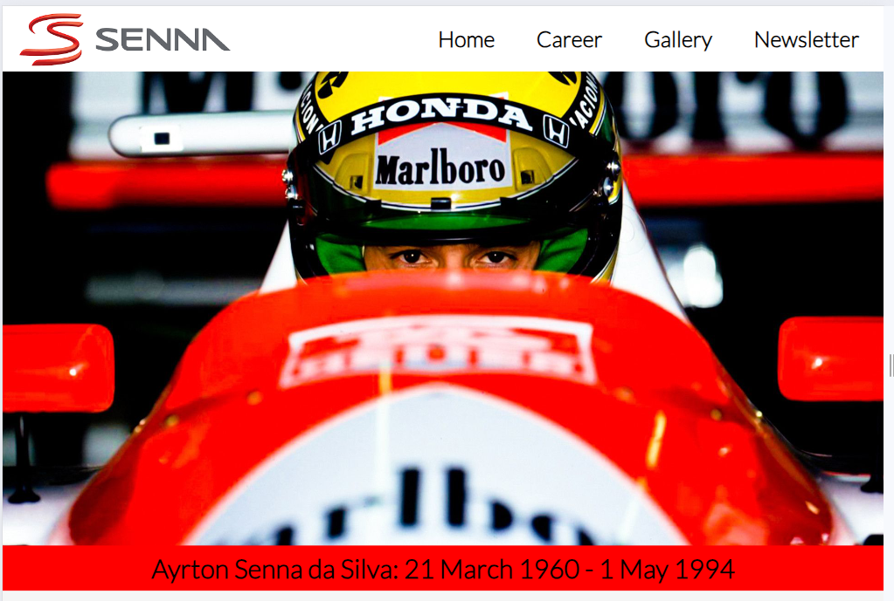
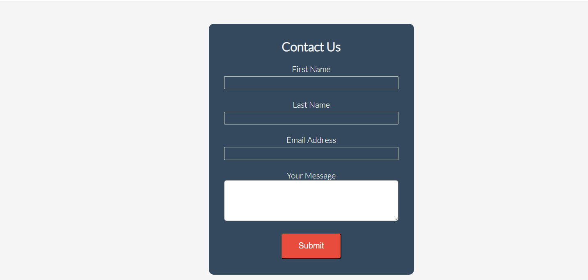

# Senna Website

## Introduction

Welcome to my first project. This project is a history website based on the life of Brazilian Formula One driver Ayrton Senna.  From his up bring in Sao Paulo, Brazil to his death at Imola in 1994, and all the highs that came inbetween.

A live website can be found [here](https://davetherave32.github.io/Senna/).

## Table of Contents

1. [User Experience (UX)](#user-experience-ux)
    1. [Project Goals](#project-goals)
   2. [First Time Visiter Goals](#first-time-visitor-goals)
   3. [Returning Visitor Goals](#returning-visitor-goals)
   4. [Frequent User Goals](#frequent-user-goals)
   5. [Color Scheme](#color-scheme)
   6. [Typography](#typography)
   7. [Wireframes](#wireframes)
2. [Features](#features)
    1. [General](#general)
    2. [Landing Page](#landing-page)
    3. [Career](#career)
    4. [Gallery](#gallery)
    5. [Newsletter](#newsletter)
 3. [Technologies Used](#technologies-used)
    1. [Languages Used](#languages-used)
    2. [Frameworks, Libraries and Programs Used](#frameworks-libraries-and-programs-used)
4. [Testing](#testing)
   1. [Automated Testing](#automated-testing)
   2. [Manual Testing](#manual-testing)
6. [Finished Product](#finished-product)
7. [Deployment](#deployment)
    1. [GitHub Pages](#github-pages)
8. [Credits](#credits)
    1. [Content](#content)
    2. [Media](#media)
    3. [Code](#code)
9. [Acknowledgements](#acknowledgements)

***

## User Experience (UX)

[Go to the top](#table-of-contents)

### Project Goals

The main goal of this website is to show more awareness of this man. I want to teach the target audience why he is rated so highly by his peers and colleagues.

### First Time Visitor Goals

As a First Time Visitor, I want to learn about the history of this person and understand why he was rated so highly.

As a First Time Visitor, I want to be able to easily navigate throughout the site to find content.

As a First Time Visitor, I want to look for statistics and facts to tell me why he's proven to be the greatest of all time.

## Returning Visitor Goals

As a Returning Visitor, I want to find information about Ayrton Senna.

As a Returning Visitor, I want to find the best way to get in contact with the organisation with any questions I may have.

## Frequent User Goals

As a Frequent User, I want to check to see if there are any newly added stats and facts.

As a Frequent User, I want to check to see if another driver will be rated as highly.

### Color Scheme

PLease find the colors schemes that I used [here](https://coolors.co/ffffff-ff0000-f5f5f5-34495e-3a3a3a)

### Typography

The main font used in the site is Lato, with Roboto as the fallback font in case Lato is not being imported correctly.

### Wireframes

[Balsamiq](https://balsamiq.com/) has been used to showcase the appearance of the site and display the placement of the different elements whitin the pages.

**Introduction** 
 
**Career** 
 
**Death** 
 
**Legacy**
 

## Features

### General

[Go to the top](#table-of-contents)

* Responsive design across all device sizes.

* Similar color scheme and design throughout all pages to effectively structure, categorise and present the information to the customers.

* **Header**

    
    - The header contains the Senna logo and fully responsive navigation bar positioned across the top of the screen.

    - The Senna logo functions as a link to the landing page.

    - The navigation bar is identical in all pages and contains links to all pages to facilitate navigation across the site. It also has a hover effect that changes color to provide feedback to the customer for a better user experience.

* **Footer**

 The footer includes a smaller version of the logo and link to social media channels.

### Landing Page

* **Main Image**

The main image is designed to attract attention, and recognition of the work of Aytron Senna.

### Career

Contains images and text, showing the history of Aytron Sennas F1 career.

### Gallery

Contains a images, showing some of Sennas fines highlights caught on film.

### Newsletter

* **Newsletter Sections**

This allows patrons to comunicate with us for future updates, ideas and to offer feedback.

## Technologies Used

[Go to the top](#table-of-contents)

### Languages Used
* [HTML5](https://en.wikipedia.org/wiki/HTML5)
* [CSS3](https://en.wikipedia.org/wiki/CSS)

### Frameworks, Libraries and Programs Used

[Go to the top](#table-of-contents)

* [Visual Studio Code](https://code.visualstudio.com/)
    - Visual Studio Code was used to write the code.

* [Google Fonts](https://fonts.google.com/)
    - Google Fonts was used to import the font Lato into the style.css file. These fonts were used throughout the site.

* [Font Awesome](https://fontawesome.com/)
     - Font Awesome was used throughout all pages to add icons in order to create a better visual experience for UX purposes.

* [GitHub Desktop](https://gitpod.io/)
     - GitHub Desktop was used for committing and then pushing the code to GitHub.

* [GitHub](https://github.com/)
     - GitHub was used to store the project after pushing.

* [Balsamiq](https://balsamiq.com/)
     - Balsamiq was used to create the wireframes during the design phase of the project.

* [Am I Responsive?](http://ami.responsivedesign.is/#)
    - Am I Responsive was used in order to see responsive design throughout the process and to generate mockup imagery to be used.

* [Responsive Design Checker](https://www.responsivedesignchecker.com/)
    - Responsive Design Checker was used in the testing process to check responsiveness on various devices.

* [Chrome DevTools](https://developer.chrome.com/docs/devtools/)
    - Chrome DevTools was used during development process for code review and to test responsiveness.

* [W3C Markup Validator](https://validator.w3.org/)
    - W3C Markup Validator was used to validate the HTML code.

* [W3C CSS Validator](https://jigsaw.w3.org/css-validator/)
    - W3C CSS Validator was used to validate the CSS code.

## Testing
  [Go to the top](#table-of-contents)

## Automated testing
### Google Developer Tools

For every element that I added to my HTML, I would add the basic CSS to my stylesheet. I would then use the inspect element to try different styles. Once I've got it to my liking I would copy the CSS from google into my stylesheet. This allows me to keep track of the code I am using.

### Responsive Tools

I used [Am I Responsive](http://ami.responsivedesign.is/) to make sure that all my pages are responsive to all devices.

### W3C Validator Tools

I used [W3C Markup](https://validator.w3.org/#validate_by_input+with_options) to check for any errors within my HTML pages.

I had an error on the index.html page with div class not being clossed correctly.

I also had an error on the gallery.html page with container class not being set correctly.

The gallery.html had an error with div class were not closed after adjustments had been made.

I used [W3C CSS Validation](https://jigsaw.w3.org/css-validator/) to check for any error within my CSS stylesheet.

## Manual Testing

I have tested my site on Safari and google chrome on multiple devices.

These include:
  - iPhone X
  - iPhone XS Max
  - iPad Pro
  - Macbook Pro

Please find below my testing process for all pages via mobile and web:

### All pages:
  - Navigation Bar:
    - Home - When selecting "home", the browser redirects me to the home page. The text in the navigation bar also stays highlighted in red. It worked as expected.
    - Career - When selecting "career", the browser redirects me to the career page. The text in the navigation bar also stays highlighted in red. It worked as expected.
    - Gallery - When selecting "gallery", the browser redirects me to the gallery page. The text in the navigation bar also stays highlighted in red. It worked as expected.
    - Newsletter - When selecting "contact", the browser redirects me to the contact page. The text in the navigation bar also stays highlighted in red. It worked as expected.

    - Text:
      - I checked that all text is in the correct and consistent size and font. I also checked that there were no typos.

    - Media:
      - I checked that all images on this page load. Making sure all images have alt text if media does not load. It worked as expected.

    - Responsiveness
      - I checked that all pages and elements were responsive. Checking each page on mobile and website and adjusting screen size to find break points. It worked as expected.

  - Footer:
    - Facebook - When selecting the Facebook icon, a new tab opens and redirects to the Facebook website. It worked as expected.
    - Twitter -  When selecting the Twitter icon, a new tab opens and redirects to the Twitter website. It worked as expected.
    - YouTube - When selecting the YouTube icon, a new tab opens and redirects to the YouTube website. It worked as expected.
    - Instagram -  When selecting the Instagram icon, a new tab opens and redirects to the Instagram website. It worked as expected.

### Career page:
  - Career:
    - Checking the statistics element is responsive on mobile and web. This worked as expected.
    - I checked for consistency within the team badges for each section in the timeline.
    - Making sure the the headers and content text is consistent in size and font.
    - I also checked that it is in chronological order.

### Gallery page:
  - Collage:
    - Testing all images respond to the screen getting smaller. The columns show a decrease if this happens. It worked as expected.

### Newsletter page:
  - Contact form:
    - Testing that each field of the form is required before submitting. It worked as expected.
    - Checking that the submit button works and processes the form.

# 5. Development Cycle
  [Go to the top](#table-of-contents)

There were many elements I changed, re-positioned and added from my original wireframes as they were more visually appealing.

### All pages:
 - Replaced the Sir Alex Photo on the top right with just a text. This is visually more appealing because the text can fit inside the navigation bar.

### Landing page:
  - The original wireframe lacked attention from users. I added an embedded YouTube video to make the user more variety with different media elements. This video is also a short introduction to what the website is about.

### Career page:
  - I added a statistics panel to show the numbers Sir Alex achieved during his career.
  - The original design shows the timeline is continuously on the left side of the page. I decided to change this to make the timeline appear on the centre of the page with the content displaying on the left then the right side of the page. This keeps the user engaged as the content isn't just a block of text.

### Testimonials page:
  - The original wireframe shows this page as an awards page with the same timeline design as the career page however, I changed this to a testimonials page. This is to give the user a better experience with a different format from the career page. As I was planning to use the same design the user would have been less engaged as they felt like they were reading the same content in the same format.
  - I added in a cards view, this gives the user smaller amounts of content so it's easy to process. The image on each card also gives the context of who the quote was from.

### Gallery page:
  - The gallery page has remained the same. I added a hover animation over each photo to give the context of what the image is about.

### Contact page:
 - After coding the contact page to the original design. I thought that it looked dull, so I added other elements to make this page visually appealing to the users.
 - Added google maps location
 - Added icons for location, telephone number and contact email.

## Finished Product

[Go to the top](#table-of-contents)

Page | Desktop version | Mobile version
--- | --- | ---
Index |  | 
Treatments |  | 
Book Now |  | 
404 Error |  | 

## Deployment

[Go to the top](#table-of-contents)

* This website was developed using [GitPod](https://www.gitpod.io/), which was then committed and pushed to GitHub using the GitPod terminal.

### GitHub Pages

[Go to the top](#table-of-contents)

* Here are the steps to deploy this website to GitHub Pages from its GitHub repository:

    1. Log in to GitHub and locate the [GitHub Repository](https://github.com/).

    2. At the top of the Repository, locate the Settings button on the menu.

        - Alternatively click [here](https://raw.githubusercontent.com/) for a GIF demostration of the process.

    3. Scroll down the Settings page until you locate the Pages section.

    4. Under Source, click the dropdown called None and select Master Branch.

    5. The page will refresh automatically and generate a link to your website.

## Credits 

[Go to the top](#table-of-contents)

### Content

[Go to the top](#table-of-contents)

- All content was written by the developer.

### Media

[Go to the top](#table-of-contents)

* [Pexels](https://www.pexels.com/)

    - Main image: "Waterfalls in the Middle of Green Trees" by Austin Tsai.
    - 404 Error Page image: Taken by Artem Beliaikin.

* [Unsplash](https://unsplash.com/)

    - About Us image: "Pristine water lily" by Jay Castor.
    - Massage image: "Beautiful Woman Getting Stones Massage in Spa Salon" by Engin Akyurt.
    - Facial image: Taken by Raphael Lovaski.
    - Pedicure image: "Warm bath before treatment" by Rune Enstad.
