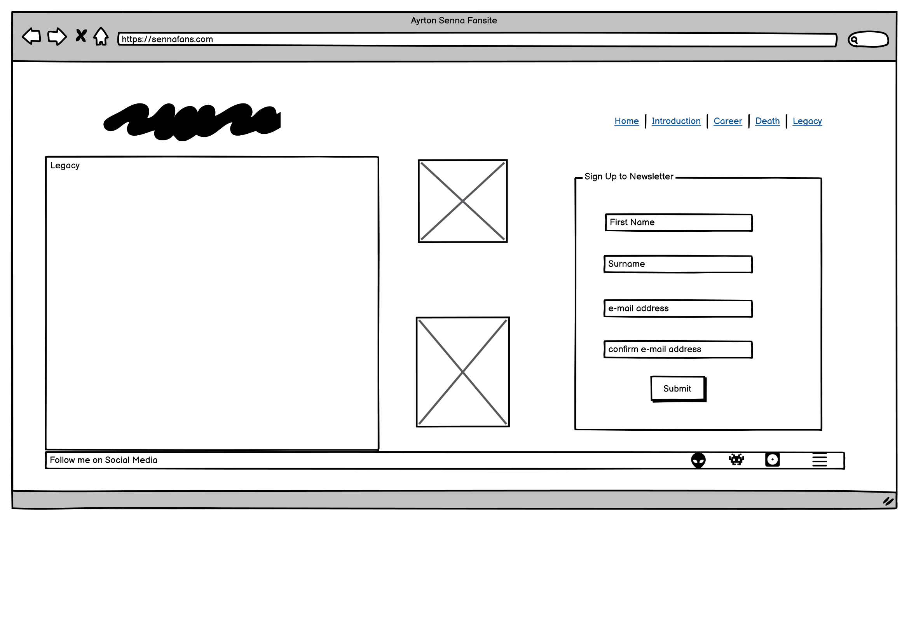

# Senna Website

## Introduction

Welcome to my first project. This project is a history website based on the life of Brazilian Formula One driver Ayrton Senna.  From his up bring in Sao Paulo, Brazil to his death at Imola in 1994, and all the highs that came inbetween.

A live website can be found [here](https://davetherave32.github.io/Senna/).

## Table of Contents

1. [User Experience (UX)](#user-experience-ux)
    1. [Project Goals](#project-goals)
   2. [First Time Visiter Goals](#first-time-visitor-goals)
   3. [Returning Visitor Goals](#returning-visitor-goals)
   4. [Frequent User Goals](#frequent-user-goals)
   5. [Color Scheme](#color-scheme)
   6. [Typography](#typography)
   7. [Wireframes](#wireframes)
2. [Features](#features)
    1. [General](#general)
    2. [Landing Page](#landing-page)
    3. [Career](#career-page)
    4. [Gallery](#gallery-page)
    5. [Newsletter](#newsletter-page)
 3. [Technologies Used](#technologies-used)
    1. [Languages Used](#languages-used)
    2. [Frameworks, Libraries and Programs Used](#frameworks-libraries-and-programs-used)
4. [Testing](#testing)
    1. [Testing User Stories](#testing-user-stories)
    2. [Code Validation](#code-validation)
    3. [Accessibility](#accessibility)
    4. [Tools Testing](#tools-testing)
    5. [Manual Testing](#manual-testing)
5. [Finished Product](#finished-product)
6. [Deployment](#deployment)
    1. [GitHub Pages](#github-pages)
7. [Credits](#credits)
    1. [Content](#content)
    2. [Media](#media)
    3. [Code](#code)
8. [Acknowledgements](#acknowledgements)

***

## User Experience (UX)

[Go to the top](#table-of-contents)

### Project Goals

The main goal of this website is to show more awareness of this man. I want to teach the target audience why he is rated so highly by his peers and colleagues.

### First Time Visitor Goals

As a First Time Visitor, I want to learn about the history of this person and understand why he was rated so highly.

As a First Time Visitor, I want to be able to easily navigate throughout the site to find content.

As a First Time Visitor, I want to look for statistics and facts to tell me why he's proven to be the greatest of all time.

## Returning Visitor Goals

As a Returning Visitor, I want to find information about Ayrton Senna.

As a Returning Visitor, I want to find the best way to get in contact with the organisation with any questions I may have.

## Frequent User Goals

As a Frequent User, I want to check to see if there are any newly added stats and facts.

As a Frequent User, I want to check to see if another driver will be rated as highly.

### Color Scheme

PLease find the colors schemes that I used [here](https://coolors.co/ffffff-ff0000-f5f5f5-34495e-3a3a3a)

### Typography

The main font used in the site is Lato, with Roboto as the fallback font in case Lato is not being imported correctly.

### Wireframes

[Balsamiq](https://balsamiq.com/) has been used to showcase the appearance of the site and display the placement of the different elements whitin the pages.

**Introduction** 
 
**Career** 
 
**Death** 
 
**Legacy**
 

## Features

### General

[Go to the top](#table-of-contents)

* Responsive design across all device sizes.

* Similar color scheme and design throughout all pages to effectively structure, categorise and present the information to the customers.

* **Header**

    
    - The header contains the Senna logo and fully responsive navigation bar positioned across the top of the screen.

    - The Senna logo functions as a link to the landing page.

    - The navigation bar is identical in all pages and contains links to all pages to facilitate navigation across the site. It also has a hover effect that changes color to provide feedback to the customer for a better user experience.

* **Footer**

    - The footer includes a smaller version of the logo and link to social media channels.

### Landing Page

* **Main Image**

    - The main image is designed to attract attention, and recognition of the work of Aytron Senna.

* **Career**

    - Contains images and text, showing the history of Aytron Sennas F1 career.

* **Gallery**

    - Contains a images, showing some of Sennas fines highlights caught on film.

### Newsletter

* **Newsletter Sections**

    -This allows patrons to comunicate with us for future updates, ideas and to offer feedback.

## Technologies Used

[Go to the top](#table-of-contents)

### Languages Used
* [HTML5](https://en.wikipedia.org/wiki/HTML5)
* [CSS3](https://en.wikipedia.org/wiki/CSS)

### Frameworks, Libraries and Programs Used

[Go to the top](#table-of-contents)

* [Google Fonts](https://fonts.google.com/)
    - Google Fonts was used to import the fonts Raleway, Cabin and Qahiri into the style.css file. These fonts were used throughout the site.

* [Font Awesome](https://fontawesome.com/)
     - Font Awesome was used throughout all pages to add icons in order to create a better visual experience for UX purposes.

* [TinyPNG](https://tinypng.com/)
    - TinyPNG was used to reduce the file size of the images for the website.

* [GitPod](https://gitpod.io/)
     - GitPod was used for writing code, committing, and then pushing to GitHub.

* [GitHub](https://github.com/)
     - GitHub was used to store the project after pushing.

* [Balsamiq](https://balsamiq.com/)
     - Balsamiq was used to create the wireframes during the design phase of the project.

* [Am I Responsive?](http://ami.responsivedesign.is/#)
    - Am I Responsive was used in order to see responsive design throughout the process and to generate mockup imagery to be used.

* [Responsive Design Checker](https://www.responsivedesignchecker.com/)
    - Responsive Design Checker was used in the testing process to check responsiveness on various devices.

* [Chrome DevTools](https://developer.chrome.com/docs/devtools/)
    - Chrome DevTools was used during development process for code review and to test responsiveness.

* [W3C Markup Validator](https://validator.w3.org/)
    - W3C Markup Validator was used to validate the HTML code.

* [W3C CSS Validator](https://jigsaw.w3.org/css-validator/)
    - W3C CSS Validator was used to validate the CSS code.

## Testing

[Go to the top](#table-of-contents)

### Testing User Stories

* As a customer, I want to be able to navigate the website intuitively and learn more about the business and treatments being offered.

     - The website offers a intuitive structure for the customers to navigate and find the information they are looking for.

    - The navigation bar is clearly presented in all pages for the customers to find with ease and it is easily navigable.

* As a customer, I want to be able to read more about the treatments available.

    - The treatments page presents all treatments available, each on their own section.

    - Each treatment section contains useful information about the respective treatment.

* As a customer, I want to easily find the contact information for the business.

    - The landing page contains a clear contact section with all necessary business' contacts

* As a customer, I want to find social media links to the business.

    - The footer provides link to the business' social media channels.

* As a customer, I want to be able to book a treatment directly from the website.

    - The book now page provides a book now form for the customer to book and schedule their next treatment.

* As a customer, I want to easily find the business' location.

    - The book now page contains a find us section with a Google map of the business' geographical location.

### Code Validation

[Go to the top](#table-of-contents)

* The [W3C Markup Validator](https://validator.w3.org/) and [W3C CSS Validator](https://jigsaw.w3.org/css-validator/) services were used to validate all pages of the project in order to ensure there were no syntax errors.

    - W3C Markup Validator found an error concerning headings not being included on the main and book now images. The section tag was replaced for a div tag to correct this. 
    
    - Another error found by W3C Markup Validator was concerning a percentage value used inside the iframe tag to declare the width property on the Book Now page. The width and height properties for the iframe were declared inside the CSS file instead.

    -  W3C CSS Validator found no errors or warnings on my CSS.

### Accessibility

[Go to the top](#table-of-contents)

* Used Lighthouse in Chrome DevTools to confirm that the colors and fonts being used in throughout the website are easy to read and accessible.

* Lighthouse reports

    - **Landing Page**

    

    - **Treatments Page**

    

    - **Book Now Page**

    

    - **404 Error Page**

    

### Tools Testing

[Go to the top](#table-of-contents)

* [Chrome DevTools](https://developer.chrome.com/docs/devtools/)

    - Chrome DevTools was used during the development process to test, explore and modify HTML elements and CSS styles used in the project.

* Responsiveness
    
    - [Am I Responsive?](http://ami.responsivedesign.is/#) was used to check responsiveness of the site pages across different devices.

    - [Responsive Design Checker](https://www.responsivedesignchecker.com/) was used to check responsiveness of the site pages on different screen sizes.
    
    - Chrome DevTools was used to test responsiveness in different screen sizes during the development process.

### Manual Testing

[Go to the top](#table-of-contents)

* Browser Compatibility

    - The website has been tested on the following browsers:

        - **Goolgle Chrome**
        
        No appearance, responsiveness nor functionality issues.

        - **Safari**
        
        No appearance, responsiveness nor functionality issues.

        - **Mozilla Firefox**
        
        There was and issue with the appearance of the book buttons on the treatments page expanding all the width. This issue was corrected by changing the width property value from "fit-content" to "max-content".
        
        No responsiveness nor functionality issues.

        - **Microsoft Edge**
        
        No appearance, responsiveness nor functionality issues.

* Device compatibility

    - The website has been tested on multiple devices, including:

        - **MacBook Pro 15"**

        No appearance, responsiveness nor functionality issues.

        - **Dell Latitude 5300**

        No appearance, responsiveness nor functionality issues.

        - **iPad Pro 12.9"**

        No appearance, responsiveness nor functionality issues.

        - **iPad Pro 10.5"**

        No appearance, responsiveness nor functionality issues.

        - **iPhone XR**
        
        No appearance, responsiveness nor functionality issues.

        - **iPhone 7**

        No appearance, responsiveness nor functionality issues.

* Common Elements Testing

    - All Pages
        
        - **Header**

            - Clicking on the main logo will bring the customer back to the landing page.

        - **Navigation Bar**

            - Hovering on the different navigation bar's links will trigger hover effect, highlighting the link for the customer.

            - Clicking on the navigation bar's links will bring the customer to the specified page.
        
        - **Footer**
        
            - Clicking on the social media links will open the specific website on a new tab.

    - Treatments Page

        - Hovering on the book button link on each treatment section will trigger hover effect, highlighting the button for the customer.

        - Clicking on the book button link on each treatment section will bring the customer to the book now page.

    - Book Now Page

        - When filling out the book now form, the customer is required to complete all fields before submitting.
        
        - Hovering over the book button will trigger hover effect, highlighting the button for the customer.

        - Clicking and dragging on the map in the find us section will move the area shown on the map. 
        
        - Clicking the plus and minus buttons changes the zoom of the map.

    - 404 Error Page

        - Entering an incorrect address into the address bar will bring the customer back to the 404 error page.

        - Hovering on the homepage link will trigger hover effect, increasing the font size of the link's text.

        - Clicking on the homepage link will bring the customer back to the landing page.

## Finished Product

[Go to the top](#table-of-contents)

Page | Desktop version | Mobile version
--- | --- | ---
Index |  | 
Treatments |  | 
Book Now |  | 
404 Error |  | 

## Deployment

[Go to the top](#table-of-contents)

* This website was developed using [GitPod](https://www.gitpod.io/), which was then committed and pushed to GitHub using the GitPod terminal.

### GitHub Pages

[Go to the top](#table-of-contents)

* Here are the steps to deploy this website to GitHub Pages from its GitHub repository:

    1. Log in to GitHub and locate the [GitHub Repository](https://github.com/).

    2. At the top of the Repository, locate the Settings button on the menu.

        - Alternatively click [here](https://raw.githubusercontent.com/) for a GIF demostration of the process.

    3. Scroll down the Settings page until you locate the Pages section.

    4. Under Source, click the dropdown called None and select Master Branch.

    5. The page will refresh automatically and generate a link to your website.

## Credits 

[Go to the top](#table-of-contents)

### Content

[Go to the top](#table-of-contents)

- All content was written by the developer.

### Media

[Go to the top](#table-of-contents)

* [Pexels](https://www.pexels.com/)

    - Main image: "Waterfalls in the Middle of Green Trees" by Austin Tsai.
    - 404 Error Page image: Taken by Artem Beliaikin.

* [Unsplash](https://unsplash.com/)

    - About Us image: "Pristine water lily" by Jay Castor.
    - Massage image: "Beautiful Woman Getting Stones Massage in Spa Salon" by Engin Akyurt.
    - Facial image: Taken by Raphael Lovaski.
    - Pedicure image: "Warm bath before treatment" by Rune Enstad.
